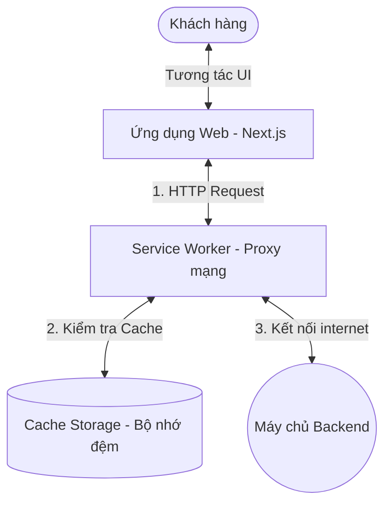
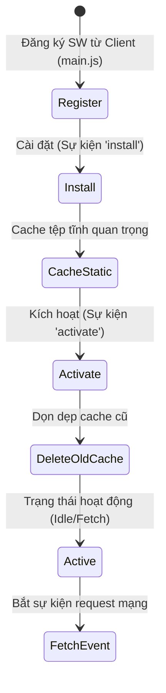
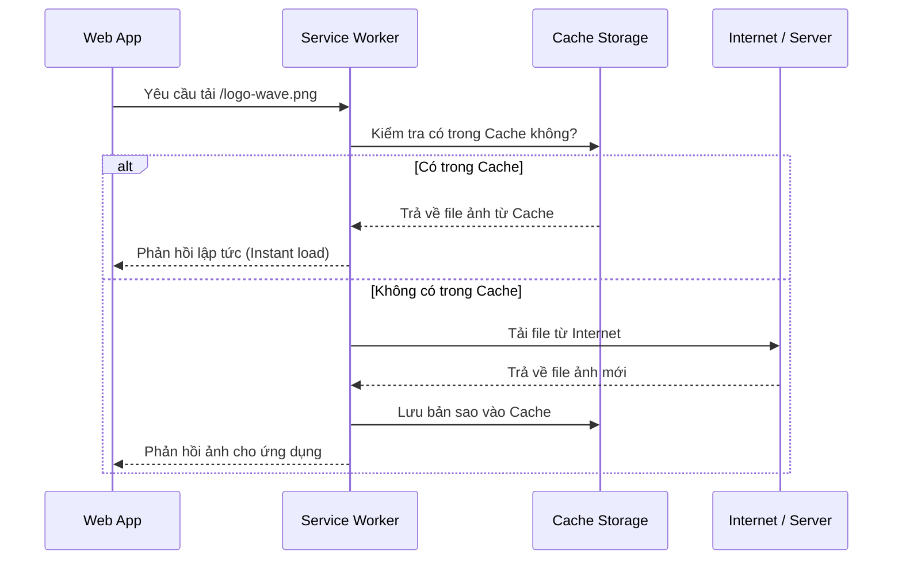

# Kiến trúc và Cách hoạt động của Progressive Web App (PWA)

Tài liệu này mô tả chi tiết cơ chế hoạt động của Progressive Web App (PWA) nói chung và cách áp dụng cụ thể vào dự án Next.js của hệ thống WAVE.

---

## 🌟 PWA là gì? Tác dụng & Lợi ích mang lại

### 1. Progressive Web App (PWA) là gì?
Progressive Web App (PWA) là một công nghệ kết hợp giữa **Website truyền thống** và **Ứng dụng di động Native App**. Nó cho phép người dùng truy cập trang web thông qua trình duyệt nhưng lại mang lại trải nghiệm mượt mà, độc lập và có khả năng cài đặt trực tiếp lên thiết bị di động/máy tính giống như một ứng dụng được tải từ App Store hay Google Play.

### 2. PWA hoạt động như thế nào? (Tác dụng chính)
PWA giải quyết các bài toán về hiệu năng và trải nghiệm người dùng thông qua các tác dụng cốt lõi:
*   **Khả năng cài đặt (Installability):** Cho phép người dùng "Thêm vào màn hình chính" (Add to Home Screen) mà không cần qua chợ ứng dụng. Khi mở lên, ứng dụng chạy trong một cửa sổ độc lập (standalone - không có thanh địa chỉ trình duyệt), mang lại cảm giác của một Native App thực thụ.
*   **Hoạt động Offline & Mạng yếu (Offline Support):** Nhờ có Service Worker chạy ngầm để chặn các request mạng và lưu trữ vào Cache Storage, PWA có thể hiển thị giao diện và các dữ liệu tĩnh đã lưu ngay cả khi thiết bị mất kết nối Internet hoặc ở trong khu vực sóng yếu.
*   **Tốc độ tải trang vượt trội (Instant Loading):** Thay vì tải lại toàn bộ tài nguyên từ máy chủ cho mỗi lần truy cập, PWA load trực tiếp các static assets (JS, CSS, hình ảnh) từ bộ nhớ đệm cục bộ của thiết bị với độ trễ gần như bằng 0.
*   **Thông báo đẩy (Push Notifications):** Cho phép gửi thông báo, nhắc nhở lịch đặt, thông tin khuyến mãi trực tiếp tới màn hình khóa của thiết bị người dùng (ngay cả khi họ đã đóng trình duyệt/ứng dụng).

### 3. Lợi ích mang lại cho dự án WAVE
Áp dụng PWA vào hệ thống WAVE mang lại những giá trị lớn cho cả khách hàng lẫn doanh nghiệp:
*   **Tiết kiệm chi phí phát triển:** Chỉ cần xây dựng và tối ưu một phiên bản Web duy nhất (Next.js), hệ thống có thể chạy mượt mà trên cả máy tính (Desktop), điện thoại iOS, và Android mà không cần code riêng app Native bằng Swift/Java.
*   **Tăng tỷ lệ giữ chân khách hàng (User Retention):** Shortcut của WAVE xuất hiện ngay trên màn hình điện thoại của khách hàng giúp họ dễ dàng truy cập và thực hiện đặt lịch dịch vụ rửa xe chỉ với một chạm.
*   **Trải nghiệm người dùng cao cấp:** Khách hàng có thể kiểm tra lịch hẹn rửa xe, xem hạng thành viên của mình ngay cả khi đang đứng ở bãi đỗ xe hầm chung cư (nơi sóng điện thoại cực kỳ yếu hoặc mất kết nối).
*   **Không tốn dung lượng thiết bị:** Thay vì tải một app nặng hàng chục, hàng trăm MB trên App Store, PWA của WAVE chỉ tốn chưa tới vài MB lưu trữ tĩnh trên bộ nhớ cache của trình duyệt.

---

## 2. Ba Thành phần Cốt lõi của PWA

### 2.1 Web App Manifest (Định danh Ứng dụng)
`manifest.json` (hoặc `manifest.ts` trong Next.js App Router) là một tệp cấu hình JSON chứa siêu dữ liệu (metadata) của ứng dụng để trình duyệt nhận diện và cài đặt.

*   **Tải trang:** Trình duyệt đọc thẻ `<link rel="manifest" href="/manifest.webmanifest">`.
*   **Điều kiện Installable:**
    *   Có `name` hoặc `short_name`.
    *   Có `start_url` hợp lệ.
    *   Thuộc tính `display` cấu hình là `standalone`, `fullscreen`, hoặc `minimal-ui`.
    *   Cung cấp ít nhất hai icon kích thước `192x192` và `512x512` định dạng PNG.
*   **Cài đặt:** Khi đáp ứng đủ điều kiện, trình duyệt kích hoạt tính năng **Install (Cài đặt)**, tạo shortcut trên màn hình thiết bị và chạy ứng dụng độc lập, không có thanh địa chỉ trình duyệt.

### 2.2 Service Worker (Trái tim của PWA)
Service Worker là một JavaScript file chạy ngầm dưới nền (background thread), hoàn toàn độc lập với luồng xử lý giao diện người dùng (main UI thread) của ứng dụng.

#### Vòng đời của Service Worker (Lifecycle)

1.  **Register (Đăng ký):** Client gọi hàm `navigator.serviceWorker.register('/sw.js')`.
2.  **Install (Cài đặt):** Kích hoạt sự kiện `install`. Dùng để tải trước và lưu cache các tài nguyên tĩnh quan trọng (như logo, trang offline fallback).
3.  **Activate (Kích hoạt):** SW mới sẵn sàng hoạt động. Thường dùng để xóa các bộ nhớ cache phiên bản cũ.
4.  **Active (Hoạt động):** SW bắt đầu lắng nghe và chặn các sự kiện mạng (`fetch`).

### 2.3 Cổng mạng an toàn (HTTPS)
Để tránh các cuộc tấn công trung gian (Man-in-the-middle) do Service Worker có khả năng can thiệp trực tiếp vào dữ liệu truyền tải:
*   Trình duyệt chỉ cho phép đăng ký Service Worker trên môi trường **HTTPS**.
*   Ngoại lệ duy nhất là **`localhost`** (hoặc `127.0.0.1`) phục vụ cho mục đích lập trình local.

---

## 3. Các Chiến lược Caching phổ biến

Mọi request HTTP đi ra từ ứng dụng web đều đi qua Service Worker. SW sẽ quyết định phản hồi dữ liệu dựa trên một trong các chiến lược sau:

### 3.1 Cache First (Ưu tiên bộ nhớ đệm)
> Áp dụng cho static assets: Hình ảnh, Font chữ, CSS biên dịch, JS tĩnh.

### 3.2 Network First (Ưu tiên mạng)
> Áp dụng cho dữ liệu động: Thông tin cá nhân, danh sách đơn hàng, API biến động.
1.  SW gửi request lên internet trước để lấy dữ liệu mới nhất từ Server.
2.  Nếu lấy thành công, trả về ứng dụng và ghi đè bản mới vào Cache.
3.  Nếu mất mạng, SW tự động lấy dữ liệu cũ đã lưu từ cache ra để thay thế, tránh hiển thị trang lỗi.

### 3.3 Stale-While-Revalidate (Lấy cache trước, cập nhật ngầm sau)
> Chiến lược tối ưu nhất cho PWA hiện đại.
1.  SW trả về dữ liệu lưu trong cache ngay lập tức để màn hình hiển thị không bị trễ (0ms delay).
2.  Đồng thời, SW âm thầm gửi request lên internet để lấy dữ liệu mới từ Server.
3.  Khi có dữ liệu mới, SW cập nhật lại bộ nhớ cache cho lần hiển thị tiếp theo.
